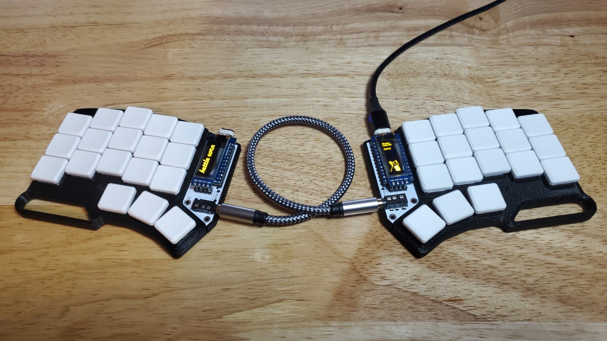

# Kettle

A 3d printed case for the [davidphilipbarr/popcorn](https://github.com/davidphilipbarr/popcorn) 5 column Choc-spaced Corne PCB, based on [MarvFPV/CorneLP_Case](https://github.com/MarvFPV/CorneLP_Case). **This case is not compatible with traditional MX-spaced Corne PCBs.**

## Assembly Notes

The case is designed around 5 m2x6mm socket head screws on each side, which screw in from the bottom directly to the top. The case halves can also be friction fit together if you're feeling bold. The bottom has cutouts for 4 8mm rubber bumpons per side. When 3d printing, use a brim to prevent warping on the corners.
